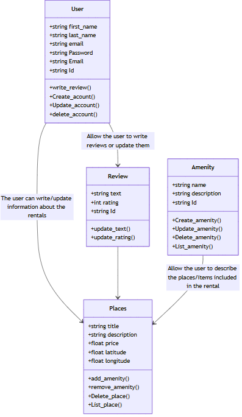

# INTRODUCTION
In this Project, we will create an application similar to the Airbnb site. In this application, the user can see multiple places that he can rental and review. He can also create an account then post on the site the places he can rent and the aminity that are selled with it.
This document is used like a summary and permit to see the project in general. We can see each of our diagramms and theirs purpose in our project.

### AUTHORS:
Enzo Messaoudi and Killian Le Boulzec

# DIAGRAMS
## High_Level_Diagram

The layer architecture is used to describe hwo an application work behind the screen. It is mainly compose of 3 layer: the presentation layer, the buisness layer and the persistence layer. Each of these layer is independant from the other and none do the same task.  
The presentation layer handles communication with the user. It displays the interface (like an HTML webpage with buttons) and collects user input. When the user performs an action (e.g., clicks a button), the presentation layer sends a request to the business layer.  
Then, the buisness layer contains the core logic of the application. It validates the requests from the presentation layer, applies business rules, and determines what actions should be taken.  
Finally, the persistence layer interacts with the database or any storage system. After the business layer has validated the request, the persistence layer performs the necessary operations to read, write, or update data in the database.  
We can use a facade pattern, like shows in the diagram, to helps us arrange how our code work. With a facade pattenr, we know what methods must be called to respect the user request.  

## Buisness_Layer_Diagram

## API Diagrams

### user_registration_Diagram

### Place_Creation_Diagram

### Review_Diagram

### Fetch_Places_Diagram
